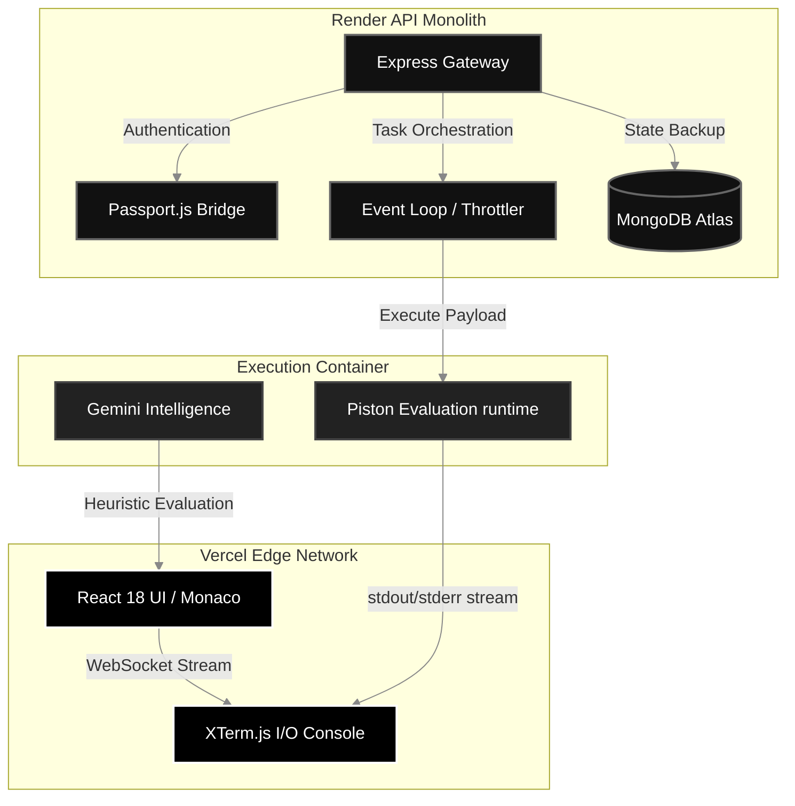

<div align="center">
  <br>
  <a href="https://sam-compiler-web.vercel.app/" target="_blank">
    
  </a>
  
  <h1><b>SAM COMPILER</b></h1>
  
  <p><b><code>SYNTAX ANALYSIS MACHINE</code></b></p>

  <br>

  <p>
    <a href="https://sam-compiler-web.vercel.app/" target="_blank">
      
    </a>
    
    
    
  </p>

  <br>

  <p>
    <i>"Precision engineering. Zero friction. Pure execution."</i>
  </p>

  <br>

  <h3>
    <a href="https://sam-compiler-web.vercel.app/">► LAUNCH WORKSPACE</a>
  </h3>
  <br>
</div>

---

## ⚡ AUTOMATED. DECOUPLED. UNSTOPPABLE.

**SAM Compiler** is not just another browser code editor. It is a highly-optimized, distributed execution engine designed to bring the raw power of a desktop IDE directly into the cloud. 

### ⚠️ Legacy IDEs vs. ⚔️ SAM Architecture

Most web-based compilers tie their UI rendering directly to their backend servers, suffering from catastrophic input lag and session crashing under load.

| ❌ The Problem | ✨ The SAM Solution |
|---|---|
| **Latency Bottlenecks**<br>Traditional Cloud IDEs feel sluggish because they block the browser UI while routing compiler logic to the server. | **Edge-Based UI Computing**<br>The UI lives entirely on Vercel's Edge Network for instant 60FPS rendering, completely detached from backend server execution logic. |
| **Race Conditions**<br>Multiple users typing at once causes massive state conflicts and accidental code deletions. | **Mathematical CRDTs**<br>Instead of locking lines, we use Conflict-free Replicated Data Types (Yjs) to seamlessly merge live multithreaded typed data. |
| **Security Vulnerabilities**<br>Executing untrusted user code (like endless Python `while` loops) crashes backend servers. | **Military-Grade gVisor Isolation**<br>Code executes inside isolated remote sandboxes on Render. It executes safely and dies harmlessly returning outputs rapidly. |

---

## 🛠️ THE TECH STACK ARSENAL

<div align="center">
  <b>Frontend Execution</b><br>
  
  
  
  
  
  <br><br>
  
  <b>API & Core Engine</b><br>
  
  
  
  
  <br><br>
  
  <b>Infrastructure & Artificial Intelligence</b><br>
  
  
</div>

<br>

<div align="center">
  <h3>The Monolith Workspace</h3>
  <br>
  <a href="https://sam-compiler-web.vercel.app/"></a>
  <br><br><br>

  <h3>Deep System Integrations</h3>
  <br>
  
  
  <br><br>
  
  
  <br><br><br>

  <h3>Engineered for Mobile</h3>
  <br>
  
  
  
  
</div>

<br>

---

## 🔥 FEATURES ENGINEERED FOR DOMINANCE

| Feature | Description |
|---|---|
| 🏎️ **Zero-Latency CRDTs** | Multi-player typing powered by Yjs Conflict-free Replicated Data Types. Real-time collaboration with math-backed state merging. |
| 🛡️ **Piston Code Execution** | Military-grade isolation. Code runs inside locked-down `gVisor` containers. Capped at 128MB RAM and 0.5 vCPUs. |
| 🧠 **Generative AI Kernel** | Integrated Google Gemini Pro. Press <kbd>Ctrl</kbd> + <kbd>/</kbd> to instantly analyze, refactor, or explain your logic. |
| 🔄 **Global State Persistence**| Every keystroke is cached. Your user session, past history, and settings are saved automatically to MongoDB Atlas. |
| 🎨 **Obsidian Design System**| A custom-built, space-black UI featuring 60FPS Framer Motion animations, glassmorphism, and responsive edge-to-edge layouts. |

---

## 🏗️ SYSTEM ARCHITECTURE & TOPOLOGY

SAM handles massive concurrent loads by utilizing a dual-node system split across Vercel and Render.



---

## 🚀 BOOTUP PROTOCOLS

To run a localized version of the SAM Compiler environment:

```bash
# 1. Clone the master repository
git clone https://github.com/syedmukheeth/SAM-Compiler.git

# 2. Boot the API Core Engine 
cd SAM-Compiler/apps/api 
npm install && npm run dev

# 3. Boot the Frontend Interface
cd ../web 
npm install && npm run dev
```
> For full architecture, environment configurations, and contribution guidelines, see [CONTRIBUTING.md](./CONTRIBUTING.md). For cloud infrastructure and scaling, refer to the [Cloud Deployment Guide](./DEPLOYMENT.md).

---

<div align="center">
  <br>
  <b>Engineered with uncompromising standards by <a href="https://linkedin.com/in/syedmukheeth">Syed Mukheeth</a>.</b><br><br>
  
  <a href="./DEPLOYMENT.md"></a>
  <br><br>
  <sub>v3.0.0-OBSIDIAN | Peak Performance Architecture</sub>
</div>
