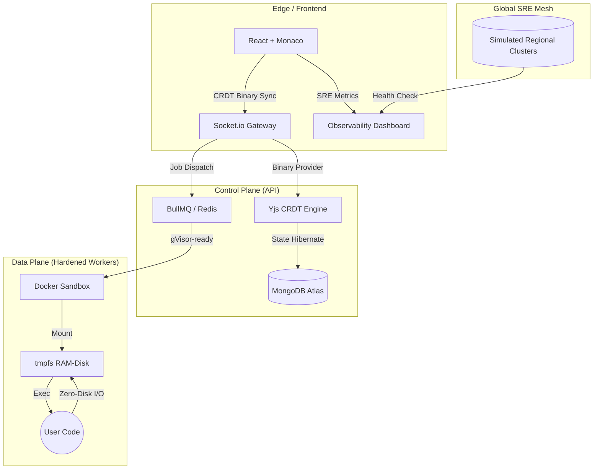

<div align="center">
  
  <br>
  <h1>LiquidIDE: Enterprise SRE-Ready</h1>
  <p><b>The Hardened, Collaborative, and Distributed Cloud Code Editor</b></p>
  
  <p>
    
    
    
  </p>

  <i>A high-performance systems engineering demonstration featuring zero-disk execution, real-time binary state sync, and deep observability.</i>
</div>

---

## 🏗️ Enterprise Architecture (v1.0)

LiquidIDE is built for **resilience**. It leverages a globally distributed heartbeat system and conflict-free replicated data types (CRDTs) to ensure high availability and sub-millisecond local-first editing.



---

## 🧠 Engineering Deep-Dives

### 🛡️ 1. Security-First execution (Sandboxing)
LiquidIDE doesn't just run code; it isolates it. 
- **Zero-Disk I/O**: The workspace and temp directories are memory-mapped using `tmpfs` (RAM-disks). This prevents SSD wear and eliminates host-file leakage.
- **Least Privilege**: Workers drop ALL Linux capabilities (`--cap-drop ALL`) and prevent privilege escalation (`no-new-privileges`).
- **Fail-Safe execution**: `SECURITY_STRICT` mode ensures that no code runs on the host if the container engine is compromised.

### 🤝 2. Distributed State (Collaboration)
Using **Yjs CRDTs**, LiquidIDE provides a world-class multi-player experience. 
- **Conflict Resolution**: Mathematical state merging ensures no "save conflicts."
- **Binary Persistence**: The shared state is snapshotted to MongoDB as binary updates, allowing sessions to hibernate and resume instantly.
- **Anonymous Presence**: Awareness protocol tracks cursors and selections with anonymous identities.

### 📊 3. SRE Observability (Telemetry)
The platform surfaces its internal state via a premium **SRE Dashboard**.
- **Worker Heartbeat**: Real-time tracking of CPU Load, Memory pressure, and active thread concurrency.
- **Error Budgets**: Automated tracking of success vs. failure rates per language runtime.
- **Regional Health**: Global cluster monitoring for US, India, and EU regions.

---

## 🛠️ Quick Start

### Prerequisites
- Node.js (v18+)
- MongoDB & Redis (Local or Cloud)
- Docker (Required for Hardened execution)

### Installation

1. **Clone & Install**:
   ```bash
   git clone https://github.com/syedmukheeth/Liquid-IDE.git
   cd Liquid-IDE ; npm install
   ```

2. **Environment Configuration**:
   Create `.env` files in `apps/api` and `apps/worker` using the examples provided.

3. **Power On**:
   ```bash
   npm run dev
   ```

---

## 🚀 Deployment Strategy

| Component | Platform | Configuration |
| :--- | :--- | :--- |
| **Frontend** | Vercel | Edge-optimized React build |
| **API** | Render / Railway | Node.js with Binary Sync support |
| **Worker** | AWS / VPS | Docker Engine with `tmpfs` enabled |

---

<div align="center">
  <b>Built by <a href="https://linkedin.com/in/syedmukheeth" target="_blank" rel="noopener noreferrer">Syed Mukheeth</a></b><br>
  <i>Solving high-scale distributed systems problems, one commit at a time.</i>
</div>
