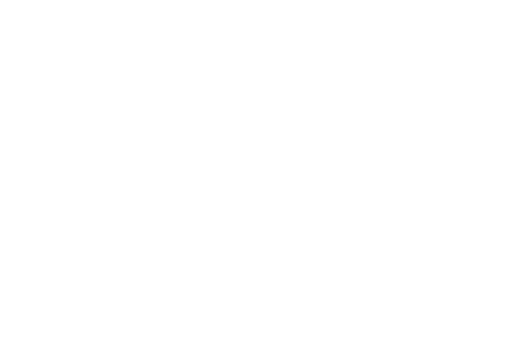
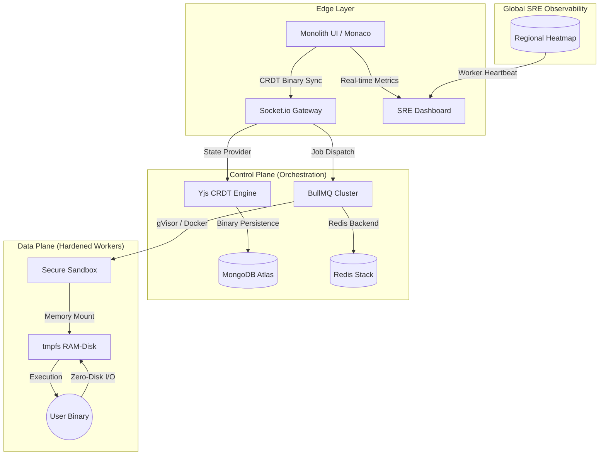

<div align="center">
  <picture>
    <source media="(prefers-color-scheme: dark)" srcset="./docs/assets/logo-dark.png">
    <source media="(prefers-color-scheme: light)" srcset="./docs/assets/logo-light.png">
    
  </picture>
  <br>
  <h1>SAM Compiler: Syntax Analysis Machine</h1>
  <p><b>A High-Scale, Hardened, and Distributed Cloud Execution Engine</b></p>
  
  <p>
    
    
    
    
  </p>

  <i>A systems engineering masterclass featuring zero-disk execution, real-time binary state synchronization, and deep SRE observability.</i>
</div>

---

## 🏛️ System Architecture

**SAM Compiler v2** is designed for **total resilience**. It orchestrates a globally distributed heartbeat mesh and conflict-free replicated data types (CRDTs) to deliver sub-millisecond local-first editing with zero data loss.



---

## ⚡ Engineering Core Pillars

### 🛡️ 1. Hardened Execution (Security-First)
In SAM Compiler, code isolation is not an afterthought—it's the foundation.
- **Zero-Disk I/O**: The workspace environment is memory-mapped using `tmpfs` (RAM-disk). This prevents SSD wear, eliminates host-file leakage, and ensures sub-microsecond file access.
- **Least Privilege Enforcement**: Workers drop ALL Linux capabilities (`--cap-drop ALL`) and enforce `no-new-privileges` to stop escalation at the kernel level.
- **Strict Mode Isolation**: `SECURITY_STRICT` ensures that if the container runtime encounters an anomaly, the job is instantly purged from both RAM and queue.

### 🤝 2. Distributed Synchronous State
Using **Yjs CRDTs**, SAM Compiler provides a world-class multi-player developer experience.
- **Mathematics over Locking**: Mathematical state merging ensures concurrent edits never conflict, eliminating the need for complex distributed locks.
*   **Binary Snapshotting**: The shared state is snapshotted to MongoDB as highly compressed binary updates, allowing sessions to hibernate and resume instantly in any regional cluster.
*   **Presence Protocol**: Awareness telemetry tracks cursors and selections in real-time with zero overhead.

### 📊 3. SRE Observability & Telemetry
The platform surfaces its internal state via a premium, integrated **SRE Dashboard**.
- **Real-time Heartbeat**: Continuous monitoring of CPU load, memory pressure, and active thread concurrency via the `sam:worker:heartbeat` mesh.
- **Error Budgets & SLOs**: Automated tracking of job success/failure rates per language runtime, with adaptive rate-limiting.
- **Regional Scalability**: Simulated cluster health for US, India, and EU regions, providing a global view of system availability.

---

## 🛠️ Technical Stack

| Layer | Technologies |
| :--- | :--- |
| **Frontend** | React 18, Framer Motion, Monaco Editor, TailwindCSS (V3) |
| **Backend** | Node.js (V20), Express, Socket.io, BullMQ |
| **Data** | MongoDB (Capped Collections), Redis (Streams/Stack) |
| **Design** | Monolith Design System (Obsidian / Off-White) |
| **Runtime** | Docker Engine, Piston (Cloud), gVisor (Optional) |

---

## 🚀 Quick Start

### Prerequisites
- **Node.js** (v18.x or v20.x recommended)
- **PNPM / NPM**
- **Docker Engine** (For local hardened execution)

### Installation

1. **Clone the repository**:
   ```bash
   git clone https://github.com/syedmukheeth/SAM-Compiler.git
   cd SAM-Compiler
   ```

2. **Install Dependencies**:
   ```bash
   npm install
   ```

3. **Configure Environment**:
   Initialize `.env` files in `apps/api` and `apps/worker` using the provided `.env.example` templates.

4. **Initialize System**:
   ```bash
   npm run dev
   ```

---

## 💼 Built by [Syed Mukheeth](https://linkedin.com/in/syedmukheeth)
*Solving high-scale distributed systems problems, one commit at a time.*

<div align="center">
  <sub>v2.0.0-PRO-O1-STABLE</sub>
</div>
