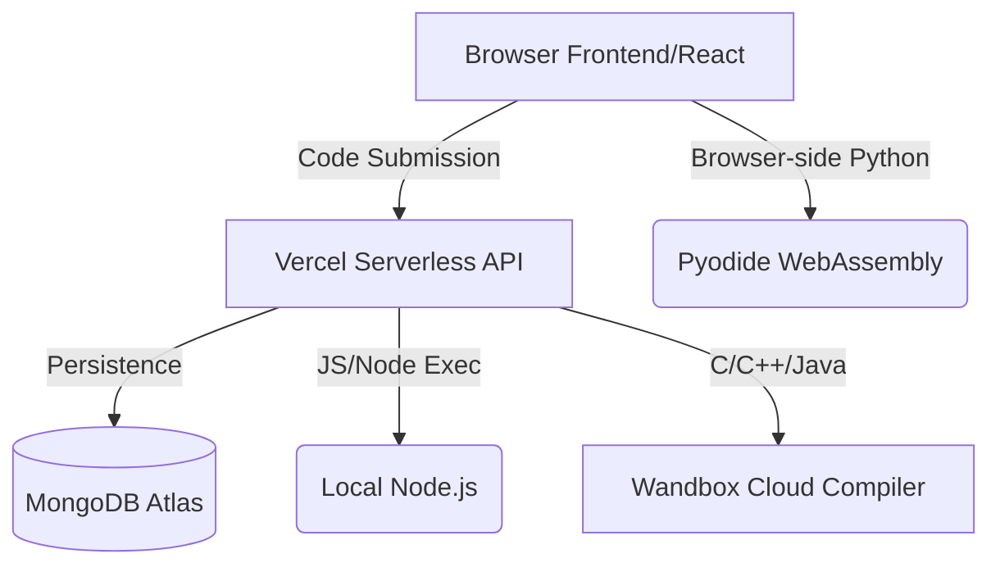

<div align="center">
  
  <br>
  <h1>LiquidIDE</h1>
  <p><b>The Next-Generation Cloud Code Editor</b></p>
  <p><i>A sleek, "Liquid Glass Apple" themed, production-ready browser IDE built for instant execution, zero-config deployments, and seamless developer experience.</i></p>
</div>

---

## ✨ Key Features

- **🚀 Instant Execution**: Run code in milliseconds. Python runs instantly in the browser via WebAssembly (Pyodide).
- **☁️ Cloud Compilation**: Seamless integration with the Wandbox API for compiling C++, C, and Java Serverless on platforms like Vercel.
- **🛡️ Dual-Execution Engine**: Automatically switches between lightning-fast local compilers (if available) and cloud execution fallbacks.
- **🔐 Social Authentication**: Built-in GitHub and Google OAuth 2.0 flows via Passport.js.
- **🎨 Premium UI/UX**: "Liquid Glass Apple" design system featuring mesh gradients, glassmorphism, Monaco Editor, and responsive layouts.
- **⚡ Vercel Optimized**: Serverless-first architecture natively deployed to Vercel without requiring long-running worker processes.

---

## 🏗️ Technical Architecture

LiquidIDE has been completely re-architected for **serverless environments**, dropping heavy Docker/BullMQ requirements in favor of a modern, lightweight, direct-execution model.



### Tech Stack
- **Frontend**: React, Vite, Monaco Editor, Tailwind CSS, Pyodide.
- **Backend API**: Node.js, Express, Mongoose, Passport.js (Auth).
- **Execution Engines**: 
  - **Browser**: Pyodide (Python)
  - **Local API**: Node.js (JavaScript), GCC/Javac (if installed)
  - **Cloud API**: Wandbox API (C, C++, Java)
- **Infrastructure**: Vercel (Hosting), MongoDB Atlas (Database).

---

## 🚀 Production Deployment (Vercel)

LiquidIDE is perfectly optimized for **Vercel** deployments. Follow these steps to host your own instance.

### 1. Database Setup
Create a free [MongoDB Atlas](https://www.mongodb.com/cloud/atlas) cluster and get your connection string. 

### 2. OAuth Configuration (Optional but Recommended)
For social logins to work:
- **GitHub**: Create an OAuth App in [GitHub Developer Settings](https://github.com/settings/developers).
- **Google**: Create OAuth Credentials in [Google Cloud Console](https://console.cloud.google.com).
- Set the redirect URIs to `https://<YOUR_API_DOMAIN>/auth/github/callback` (and `/auth/google/callback`).

### 3. Deploy to Vercel
You will deploy LiquidIDE as two separate Vercel projects (Frontend and API) from this Monorepo.

#### Backend (API) Deployment
1. Import the repository into Vercel.
2. Set the **Root Directory** to `apps/api`.
3. Vercel will automatically detect `api/index.js` as a Serverless Function based on `vercel.json`.
4. Add the following **Environment Variables**:
   ```env
   NODE_ENV=production
   PORT=8080
   MONGO_URI=mongodb+srv://<user>:<password>@cluster...
   WEB_ORIGIN=https://<YOUR_FRONTEND_DOMAIN>
   JWT_SECRET=your_super_secret_jwt_key
   
   # Social Logins
   CALLBACK_URL_BASE=https://<YOUR_API_DOMAIN>/auth
   GITHUB_CLIENT_ID=your_github_client_id
   GITHUB_CLIENT_SECRET=your_github_client_secret
   GOOGLE_CLIENT_ID=your_google_client_id
   GOOGLE_CLIENT_SECRET=your_google_client_secret
   ```

#### Frontend (Web) Deployment
1. Import the repository into Vercel again.
2. Set the **Root Directory** to `apps/web`.
3. Framework preset: **Vite**.
4. Add the following **Environment Variable**:
   ```env
   VITE_API_URL=https://<YOUR_API_DOMAIN>
   ```

---

## 🛠️ Local Development

### Prerequisites
- Node.js (v18+)
- MongoDB (Running locally or via Atlas)
- (Optional) `gcc`, `g++`, and `javac` installed on your machine for fast local code execution instead of Cloud fallbacks.

### Setup Instructions

1. **Clone the Repository**:
   ```bash
   git clone https://github.com/syedmukheeth/Liquid-IDE.git
   cd Liquid-IDE
   ```

2. **Install Dependencies**:
   Install monorepo dependencies from the root:
   ```bash
   npm install
   ```

3. **Configure Environment Variables**:
   - In `apps/api/.env`:
     ```env
     PORT=8080
     MONGO_URI=your_mongodb_connection_string
     WEB_ORIGIN=http://localhost:5173
     JWT_SECRET=local_development_secret
     CALLBACK_URL_BASE=http://localhost:8080/auth
     ```
   - In `apps/web/.env`:
     ```env
     VITE_API_URL=http://localhost:8080
     ```

4. **Start the Development Servers**:
   Terminal 1 (Backend API):
   ```bash
   cd apps/api
   npm run dev
   ```
   
   Terminal 2 (Frontend Web):
   ```bash
   cd apps/web
   npm run dev
   ```

5. **Open your browser** to `http://localhost:5173`.

---

<div align="center">
  <i>Built with ❤️ for developers who need a safe, fluid, and powerful playground.</i>
</div>
