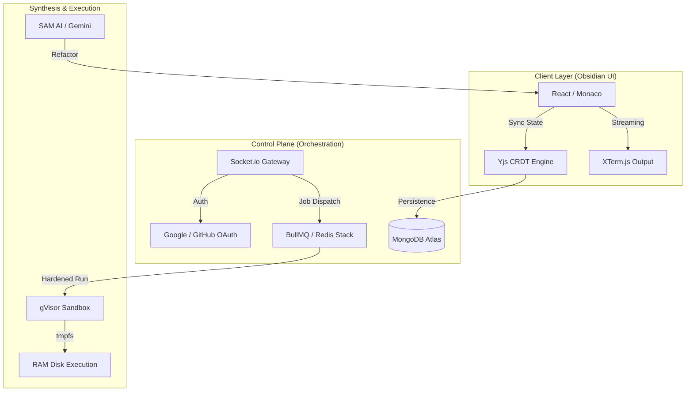

<div align="center">
  
  <br>
  <h1>SAM Compiler — The Obsidian Monolith</h1>
  <p><b>High-Performance, Multi-Language Cloud IDE with AI Synthesis</b></p>

  <p>
    
    
    
    
  </p>

  <i>A precision-engineered development engine featuring zero-lag collaboration, hardened sandboxing, and a high-fidelity monochromatic aesthetic.</i>
</div>

---

## 🌑 The SAM Identity

**SAM Compiler** is not just an editor; it's a statement in minimal engineering. Built on the **Obsidian Monolith** design system, it provides a sanctuary for developers where distractions are obliterated by a strict monochromatic interface. 

Underneath the glassmorphism and slate accents lies a powerhouse of **distributed systems**: from **CRDT-based synchronization** to **gVisor-hardened execution kernels**, SAM is built for scale, security, and speed.

---

## ⚡ Key Features

### 🖋️ Professional IDE Suite
*   **Monaco Engine**: Powered by the same core as VS Code, optimized with custom Obsidian themes.
*   **Polyglot Runtime**: Native, lightning-fast execution for **C++, C, Python, JavaScript, and Java**.
*   **Real-time Multi-player**: Conflict-free collaborative editing powered by **Yjs CRDTs** and WebSockets.
*   **Integrated Terminal**: High-fidelity XTerm.js integration for real-time output streaming.

### 🧠 SAM AI Synthesis
*   **Gemini Pro Powered**: Built-in AI assistant for complex refactoring, bug hunting, and logic explanation.
*   **Context-Aware**: One-click "Apply Code" to instantly merge AI-suggested improvements into your workspace.

### 🛡️ Enterprise-Grade Security
*   **Hardened Sandboxing**: Every execution run is isolated using **gVisor** (Google's container sandbox) and Docker.
*   **Session Isolation**: Automatic, randomized room generation ensures your private code stays private.
*   **OAuth Lifecycle**: Secure "Continue with Google/GitHub" integration via Passport.js.

### 📱 Edge Responsiveness
*   **Mobile-First Design**: A complete mobile UI overhaul with adaptive headers and touch-optimized editor controls.
*   **Zero-Install**: Fully functional in any modern browser, from desktop workstations to mobile devices.

---

## 🏛️ System Architecture

SAM utilizes a distributed control plane to manage isolation and high-frequency synchronization.



---

## 🛠️ Performance Tech Stack

| Domain | Technology | Implementation |
| :--- | :--- | :--- |
| **Frontend** | React 18 / Vite | High-frequency UI updates & Framer Motion |
| **Editor** | Monaco / Yjs | Professional editing with binary CRDT sync |
| **Backend** | Node.js / Express | Distributed task orchestration & JWT security |
| **Queue** | BullMQ / Redis | High-throughput background code execution |
| **Security** | gVisor / Docker | Multi-layer kernel isolation for user code |
| **AI** | Google Gemini | Large Language Model synthesis & explanation |

---

## 🚀 Quick Start

### 1. Prerequisities
-   **Node.js** (v18+)
-   **Docker** (for secure Cloud execution)
-   **Redis & MongoDB** (Local or Cloud instances)

### 2. Monorepo Installation
```bash
# Clone the repository
git clone https://github.com/syedmukheeth/SAM-Compiler.git
cd SAM-Compiler

# Install all workspace dependencies
npm install

# Launch Development Environment (All Apps)
npm run dev
```

### 3. Environment Secrets
Create `.env` files in `apps/api` and `apps/web`.

**Required `apps/api/.env`:**
```env
PORT=8080
MONGO_URI=mongodb+srv://...
REDIS_URL=rediss://...
GITHUB_CLIENT_ID=...
GITHUB_CLIENT_SECRET=...
GOOGLE_CLIENT_ID=...
GOOGLE_CLIENT_SECRET=...
GEMINI_API_KEY=...
```

---

## 💼 Engineer & Designer
**[Syed Mukheeth](https://linkedin.com/in/syedmukheeth)**
*Specializing in High-Scale Distributed Infrastructure and Modern UX Engineering.*

<div align="center">
  <br>
  
  <br>
  <sub>v3.0.0-OBSIDIAN | Handcrafted with Precision</sub>
</div>
