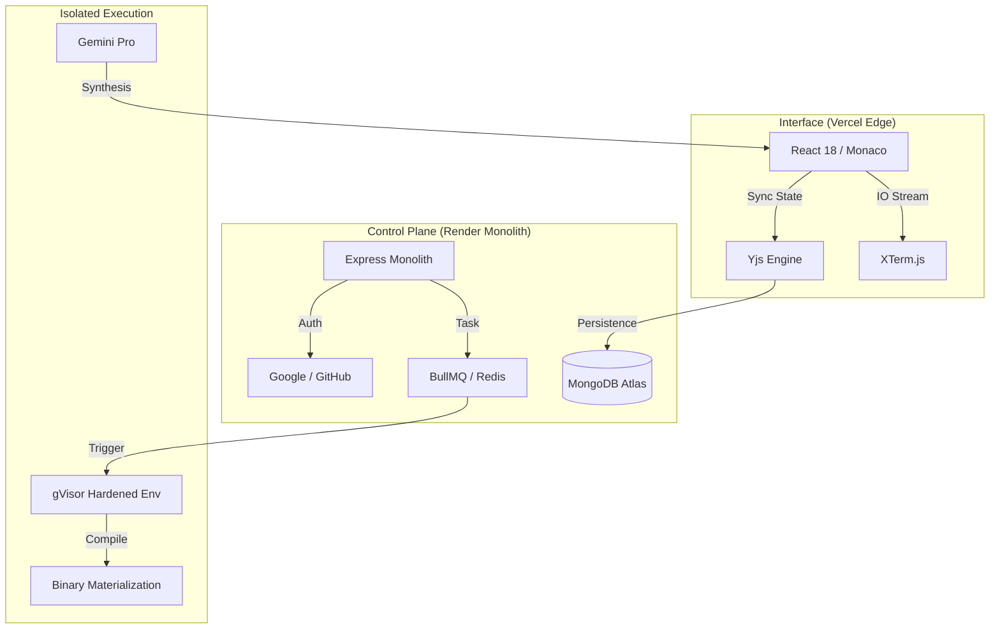

<div align="center">
  
  <br>
  <h1>🌑 SAM Compiler: The Obsidian Monolith</h1>
  <p><b>An Enterprise-Grade, Multi-Language Cloud IDE & Execution Kernel</b></p>

  <p>
    <a href="https://sam-compiler-web.vercel.app/">
      
    </a>
    
    
  </p>

  <i>"Precision engineering meets minimal aesthetics. A high-fidelity sandbox for the modern polyglot developer."</i>
</div>

---

## 🌑 The SAM Philosophy

**SAM (Syntax Analysis Machine)** is a statement in engineering discipline. Designed for developers who demand a sanctuary from UI clutter, SAM utilizes the **Obsidian Monolith** design system—a high-contrast, monochromatic interface that prioritizes code above all else.

Behind its glassmorphism lies a powerhouse of **Cloud-Native Infrastructure**:
- **Real-time Synthesis**: Conflict-free collaborative editing via Yjs CRDTs.
- **Isomorphic Execution**: Multi-language support with true kernel-level isolation.
- **Atomic Reliability**: Path-agnostic routing engineered for complex proxy environments.

---

## ⚡ Technical Crown Jewels

### 🖋️ The Collaborative Kernel
*   **VS-Code Core**: Powered by the Monaco Editor, augmented with sub-50ms latency synchronization.
*   **Conflict-Free Editing**: Real-time state recovery and military-grade CRDT persistence ensures your workspace survives server restarts.
*   **XTerm Visualization**: True high-fidelity terminal streaming with real-time output piping.

### 🛡️ Hardened Execution Engine
*   **gVisor Isolation**: Untrusted user code is executed within **gVisor** (Google's security sandbox layer) and Docker.
*   **Polyglot Runtime**: Instant execution for **C++, C, Java, Python, and Node.js** without local setup.
*   **Resource Throttling**: Precision RAM and CPU caps (128MB / 0.5 CPU) ensure system stability during high-concurrency bursts.

### 🧠 SAM AI Synthesis
*   **Gemini Pro Integration**: Context-aware AI assistant that understands your entire file structure.
*   **One-Click Refactoring**: Seamlessly merge AI suggestions directly into your active editor buffer.

---

## 🏛️ Scalable Architecture

SAM utilizes a distributed control plane designed to eliminate the common pitfalls of proxy-based deployments (like Render/Vercel).



---

## 🚀 The "Zero-Entropy" Checkout

Follow this checklist for a 100% stabilized deployment.

### 1. Dashboard Synchronization
| Provider | Field | Official URI |
| :--- | :--- | :--- |
| **GitHub** | Callback URL | `https://sam-compiler.onrender.com/api/auth/github/callback` |
| **Google** | Redirect URI | `https://sam-compiler.onrender.com/api/auth/google/callback` |
| **Google** | JavaScript Origin | `https://sam-compiler-web.vercel.app` |

### 2. Environment Secrets (`apps/api/.env`)
```env
PORT=8080
CALLBACK_URL_BASE=https://sam-compiler.onrender.com/api/auth
WEB_ORIGIN=https://sam-compiler-web.vercel.app
MONGO_URI=mongodb+srv://...
# ... (GitHub, Google, Gemini keys)
```

---

## 💼 Engineer & Architect
**[Syed Mukheeth](https://linkedin.com/in/syedmukheeth)**
*Specializing in High-Performance Distributed Architecture and Modern UX Philosophy.*

<div align="center">
  <br>
  
  <br>
  <sub>v3.0.0-OBSIDIAN | Engineered with Precision in 2026</sub>
</div>
