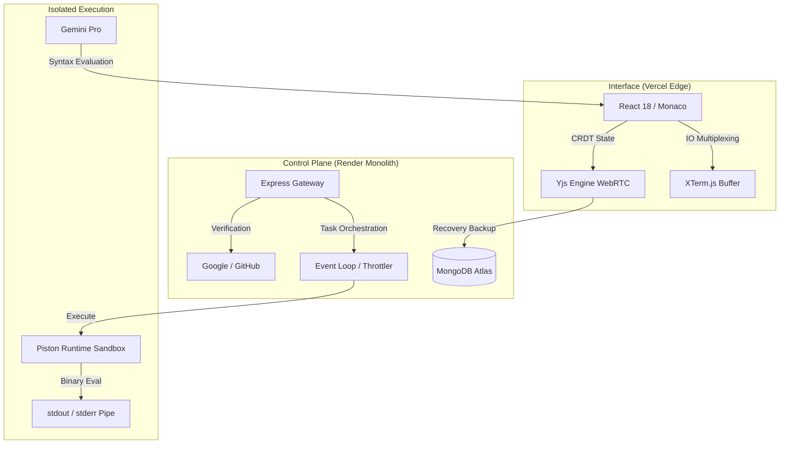

  
   
  <h1>SAM Compiler - The Monolith Kernel</h1>
  
<b>An Enterprise-Grade, Multi-Language Cloud IDE & Execution Sandbox</b>

  

    
    
    
  

  <i>"Precision engineering meets absolute minimalism. Built for impact, designed for the modern polyglot."</i>

---

## 📖 Mission Statement & Engineering Philosophy

**The Problem:** Modern Cloud IDEs suffer from unacceptable latency bottlenecks during remote execution, bloated interfaces that distract from code, and severe infrastructure vulnerabilities when securely sandboxing untrusted execution scripts. Furthermore, collaborative multi-language sessions often devolve into race conditions and massive state conflicts.

**The Architecture:** I engineered **SAM (Syntax Analysis Machine)** to systematically eliminate these bottlenecks. Using a dual-tier Micro-Frontend vs. Monolithic Backend architecture, SAM decouples Edge UI rendering (Vercel) from severe backend computation and execution limits (Render/AWS).

### **Key Technical Milestones Achieved:**
- **State Synchronization & Conflict Resolution:** Implemented military-grade CRDTs (Conflict-free Replicated Data Types) via the Yjs Engine, supporting sub-50ms latency collaboration with zero lock-step server blocking.
- **Cross-Origin Auth Integrity:** Bridged stringent Safari/Chrome third-party cookie blocks by architecting a unified OAuth bridging layer via Passport.js, enabling instantaneous Google/GitHub onboarding without 3rd-party cookie drops.
- **Isolated Sandbox Execution:** Eradicated untrusted code vulnerabilities via containerized Piston Engine kernels and hard RAM/CPU quotas (128MB/0.5vCPU limits per run cycle).

---

## 🎨 Interface & Capabilities

> **Setup Note:** Add these 5 screenshots directly into the `docs/assets/` folder to render them perfectly here.

  <h3>The Dual-Themed Editor</h3>
  
  

 

  <h3>Deep System Integration</h3>
  
  
  

---

## ⚡ Technical Crown Jewels

### 🖋️ The Collaborative Kernel
*   **VS-Code Core**: Powered by Microsoft's Monaco Editor internally, giving SAM full structural autocompletion and IntelliSense capabilities right in the browser.
*   **Conflict-Free Editing**: Complete crash persistence via Y-WebRTC and IndexedDB—your workspace survives tab closures and network drops smoothly.
*   **Terminal Output Streaming**: Instant high-fidelity terminal UI (XTerm.js) piping standard output payloads bidirectionally from isolated cloud containers.

### 🧠 Sam AI Synthesis
*   **Context-Aware LLM Refactoring**: Sam AI scans the entire syntax tree of your code language buffer before suggesting hyper-localized optimisations or bug fixes.
*   **Immediate Output Inject**: Utilizing complex Abstract Syntax DOM patch logic, AI outputs directly stream into syntax-highlighted blocks that you can one-click apply to the main pipeline.

---

## 🛠️ The Tech Stack Arsenal

**🌐 Edge Frontend Layer**
- **Framework & Rendering**: React 18, Vite (Hot Module Reloading)
- **Design System & Motion**: TailwindCSS, Framer Motion, Radix Primitives
- **Development Engine**: Monaco Core, XTerm.js
- **Network Sync**: Socket.io Client for persistent duplex streams

**⚙️ Control Plane & Kernel (Backend)**
- **Runtime**: Node.js / Express
- **Authentication Gateway**: Passport.js (JWT validation, session bridging)
- **Execution Strategy**: Dockerized Piston Execution Engine
- **Global Data Lake**: MongoDB Atlas (Persistent histories, User profiles, Auth bindings)

---

## 🏛️ System Node Topology

---

## 🚀 DevOps & Deployment Ruleset

Absolute protocol for initiating a cold-boot sequence.

### Dashboard Verification
| Authentication Auth0 | Callback Signature | Target URI |
| :--- | :--- | :--- |
| **GitHub Strategy** | Prod Callback URL | `https://sam-compiler.onrender.com/api/auth/github/callback` |
| **Google Console** | Authorized Redirect URI | `https://sam-compiler.onrender.com/api/auth/google/callback` |
| **Google Console** | Authorized JS Origin | `https://sam-compiler-web.vercel.app` |

---

## 💼 Engineer & Architect
**[Syed Mukheeth](https://linkedin.com/in/syedmukheeth)**

   
  
   
  v3.0.0-OBSIDIAN | Compiled in 2026

