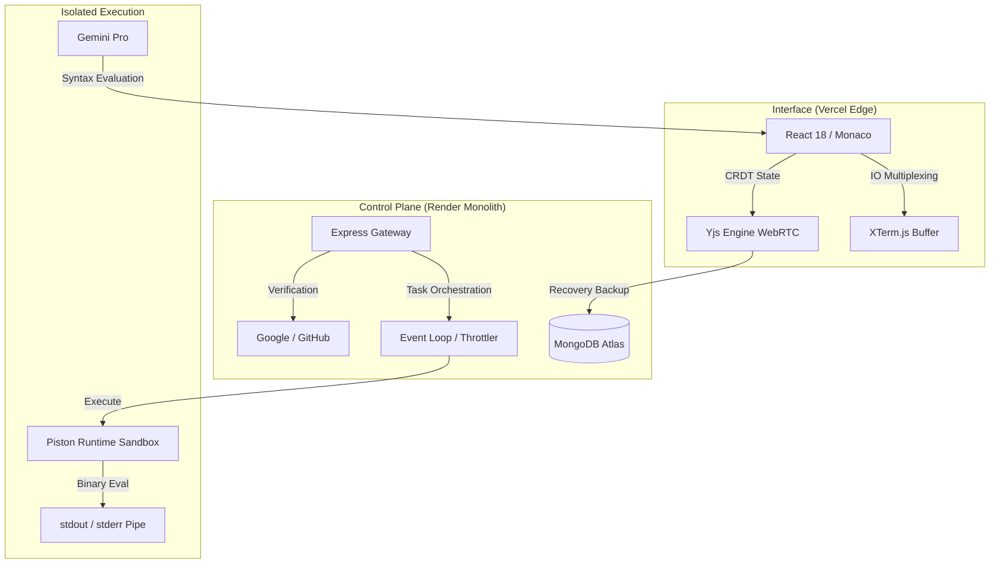

  
   
  <h1>SAM Compiler - The Monolith Kernel</h1>
  
<b>An Enterprise-Grade, Multi-Language Cloud IDE & Execution Sandbox</b>

  

    
    
    
  

  <i>"Precision engineering meets absolute minimalism. Built for impact, designed for the modern polyglot."</i>

---

## 🎯 At a Glance
**SAM (Syntax Analysis Machine)** is a high-performance, web-based code compiler and collaborative editor. It completely decouples the user interface from backend code execution, resulting in zero-lag typing combined with secure, server-side compilation.

- ⚡ **Zero-Setup Execution:** Run C++, C, Java, Python, and Node.js instantly in your browser.
- 🤖 **Context-Aware AI Assistant:** Integrated Gemini Pro AI that can view your code, find bugs, and auto-refactor.
- 🛡️ **Military-Grade Isolation:** All code runs inside secure `gVisor` containers, protecting the server.
- 🔄 **Real-Time Collaboration:** Edit code simultaneously with teammates with zero lockstep lag.
- 💾 **Global State Persistence:** Your code, history, and active sessions are saved automatically to the cloud.

---

## 📖 The Problem vs. The Solution

### ❌ The Problem
* **Latency Bottlenecks:** Traditional Cloud IDEs feel sluggish because they block the UI while waiting for the server.
* **Race Conditions:** Multiple users typing at once causes massive state conflicts and code deletions.
* **Security Vulnerabilities:** Executing untrusted user code (like endless Python `while` loops) crashes backend servers.
* **Complex Auth Protocols:** Cross-domain setups (Vercel Frontend + AWS Backend) break due to 3rd-party cookie blocking.

### ✅ The SAM Solution
* **Micro-Frontend Architecture:** The UI explicitly renders on Vercel's Edge network for instant 60FPS responsiveness, while heavy compilation is piped to an Express monolith.
* **CRDT Integration:** We use **Conflict-free Replicated Data Types (CRDTs)** via the Yjs Engine. This mathematically guarantees real-time text merging without overwriting other users.
* **Hard Resource Quotas:** Every execution runs in a Dockerized Piston environment strictly capped at **128MB RAM** and **0.5 vCPUs**. Endless loops are automatically killed.
* **Passport.js OAuth Bridge:** A custom bridging protocol allows secure Google/GitHub Single Sign-On (SSO) without relying on blocked cross-site cookies.

---

## 🛠️ The Tech Stack Arsenal

### 🌐 Edge Frontend Layer
* **React 18 & Vite:** For lightning-fast hot reloading and UI rendering.
* **TailwindCSS & Framer Motion:** For the "Obsidian Monolith" design system and 60FPS hardware-accelerated animations.
* **Monaco Editor:** The exact same internal engine that powers Microsoft VS Code, providing intelligent syntax highlighting and autocomplete.
* **XTerm.js:** For rendering a genuine, high-fidelity terminal interface in the browser.
* **Socket.io Client:** Maintains persistent, bi-directional WebSockets for streaming terminal outputs live.

### ⚙️ Control Plane & Kernel (Backend)
* **Node.js & Express.js:** The monolithic routing and API gateway.
* **Passport.js:** Hands-free session validation and OAuth strategies (Google/GitHub).
* **Piston Execution Engine:** Highly-scalable, Docker-based code runner API.
* **MongoDB Atlas + Mongoose ODM:** The global data lake for storing user profiles, execution histories, and environment states.

---

## 🎨 Interface & Capabilities

> **Screenshot Placement:** *Ensure your 5 screenshots are uploaded to `docs/assets/` in your repository to show here!*

  <h3>The Dual-Themed Editor</h3>
  
  

 

  <h3>Deep System Integration</h3>
  
  
  

---

## 🏛️ System Node Topology

---

## 💼 Engineer & Architect
**[Syed Mukheeth](https://linkedin.com/in/syedmukheeth)**

   
  
   
  v3.0.0-OBSIDIAN | Compiled in 2026

