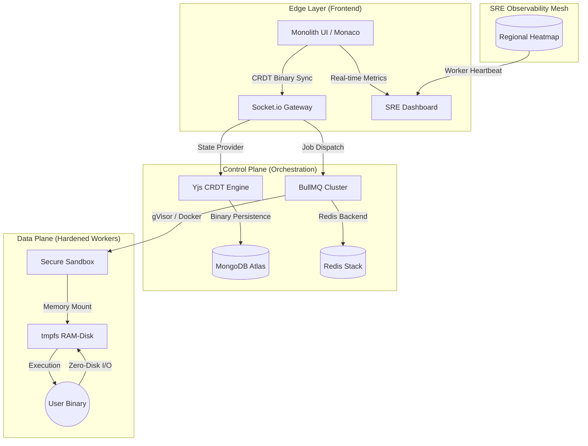

<div align="center">
  <picture>
    <source media="(prefers-color-scheme: dark)" srcset="./docs/assets/logo-dark.png">
    <source media="(prefers-color-scheme: light)" srcset="./docs/assets/logo-light.png">
    
  </picture>
  <br>
  <h1>SAM Compiler: Syntax Analysis Machine</h1>
  <p><b>A High-Scale, Hardened, and Distributed Cloud Execution Engine</b></p>
  
  <p>
    
    
    
    
  </p>

  <i>A systems engineering masterclass featuring zero-disk execution, real-time binary state synchronization, and deep SRE observability.</i>
</div>

---

## 🌟 Executive Summary

**SAM Compiler** (Syntax Analysis Machine) is a next-generation cloud IDE and execution environment designed for developers who demand absolute security, high-scale performance, and seamless collaboration. Built on a foundation of **distributed systems** and **hardened security primitives**, SAM transforms your browser into a powerful, low-latency development terminal.

Unlike traditional web-based editors, SAM handles execution at the edge using a **multi-layer sandbox model**, ensuring that your code runs in a high-performance environment with sub-millisecond local-first editing.

---

## 🚀 Key Features

### 💻 Unified Multi-Language IDE
*   **Monaco Engine**: Powered by the same editor as VS Code, featuring IntelliSense and high-fidelity syntax highlighting.
*   **Polyglot Support**: Native support for **C++, Python, Java, JavaScript, Rust, and Go**.
*   **Smart AI Copilot**: Direct integration with Gemini Pro for real-time code fixes, refactoring, and explanations.

### 🤝 Conflict-Free Real-time Collaboration (CRDT)
*   **Yjs Binary Sync**: Uses Conflict-free Replicated Data Types (CRDTs) for mathematical state merging. No locking, no conflicts—just pure real-time sync.
*   **Presence Awareness**: Tracks cursor positions and selections across users with ultra-low latency via Socket.io.
*   **Snapshot Persistence**: Binary state is snapshotted to a persistent layer, allowing sessions to hibernate and resume instantly.

### 🛡️ Hardened Execution (Security-First)
*   **gVisor/Docker Isolation**: Each execution job is jailed in a secure, least-privilege container.
*   **Zero-Disk I/O (`tmpfs`)**: Workspaces are memory-mapped to RAM-disks. This eliminates host-file leakage and ensures enterprise-grade isolation.
*   **Immutable Runtimes**: Every execution starts from a clean, hardened base image with all Linux capabilities dropped.

### 📊 SRE Observability & Metrics
*   **Heartbeat Mesh**: Real-time worker health monitoring via a distributed heartbeat system.
*   **Performance Telemetry**: Instant visualization of CPU load, memory pressure, and execution latency.
*   **Intelligent Load-Balancing**: Automated job dispatching via BullMQ cluster for optimal resource utilization.

---

## 🏛️ Advanced Architecture

The platform is architected into a clear separation of concerns, moving from a low-latency **Client-Side Edge** to a high-capacity **Execution Data Plane**.



---

## 🛠️ The "SAM-Stack"

| Layer | Technologies | Role |
| :--- | :--- | :--- |
| **Monolith UI** | React 18, Framer Motion, Monaco Editor | High-fidelity, smooth developer experience |
| **State Sync** | Yjs, Socket.io, Binary Snapshotting | Distributed real-time collaboration |
| **Logic & API** | Node.js (V20), Express, Zod | Orchestration, Validation, and Routing |
| **Task Queue** | BullMQ, Redis Stack | High-throughput async job management |
| **Data Layer** | MongoDB Atlas, Redis Streams | Persistence and real-time event streaming |
| **Worker runtime** | Docker API, gVisor, Multi-Sandbox | Hardened, isolated code execution |
| **Observability** | Pino, SRE Dashboard, Heartbeat | Telemetry, logging, and health monitoring |

---

## 🏃 Local Development Guide

SAM is designed as a **Monorepo** using NPM Workspaces.

### 1. Prerequisites
*   **Node.js**: v20 or higher
*   **Docker Engine**: Required for code execution
*   **Redis**: For BullMQ and heartbeat mesh
*   **MongoDB**: For session persistence

### 2. Quick Start
```bash
# Clone the repository
git clone https://github.com/syedmukheeth/SAM-Compiler.git
cd SAM-Compiler

# Install all dependencies (automatic across workspaces)
npm install

# Setup Environment Variables
# Copy .env.example to .env in: apps/api, apps/web, apps/worker

# Start the full ecosystem concurrently
npm run dev
```

### 3. Monorepo Organization
*   `apps/web`: The React-based frontend IDE.
*   `apps/api`: The primary API gateway and Socket.io server.
*   `apps/worker`: The execution worker that handles Docker-based code runs.
*   `packages/*`: Shared utilities, types, and constants (if any).

---

## 🌐 Deployment

For enterprise-grade cloud hosting, see our **[DEPLOYMENT.md](./DEPLOYMENT.md)** guide. We recommend the following:
*   **Vercel** for the `web` workspace.
*   **Render** or **Railway** (with Docker support) for the `api` and `worker` instances to support C++/Java compilation.

---

## 🔒 Security Policy
SAM Compiler takes security seriously. Every execution job is:
1.  Stripped of all Linux capabilities (`--cap-drop ALL`).
2.  Isolated with `no-new-privileges`.
3.  Executed on a `tmpfs` non-persistent RAM-disk.
4.  Optionally protected by **gVisor** (Google's user-space kernel) in production environments.

---

## 💼 Built by [Syed Mukheeth](https://linkedin.com/in/syedmukheeth)
*Engineering distributed systems that scale. Solving complex problems, one commit at a time.*

<div align="center">
  <br>
  
  <br>
  <sub>v2.2.0-STABLE | Part of the MONOLITH Design ecosystem</sub>
</div>

