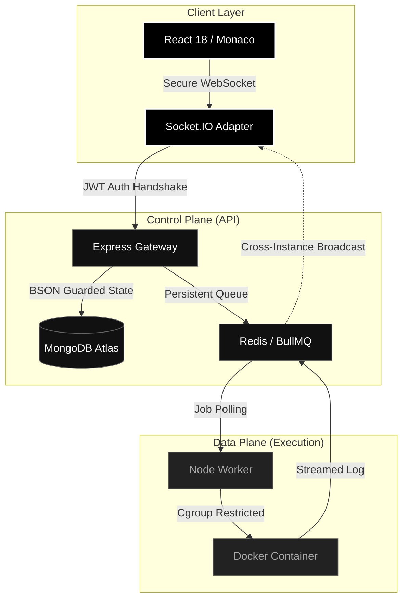

   
  
  
  <h1><b>SAM COMPILER</b></h1>
  
  
<b><code>SYNTAX ANALYSIS MACHINE : DISTRIBUTED KERNEL EDITION</code></b>

  

    <i>"Architected for absolute resilience. Engineered for sub-millisecond precision."</i>
  

  

    
    
    
    
  

   

  <h3>
    <a href="https://sam-compiler-web.vercel.app/">► ENTER WORKSPACE</a>
  </h3>
   

---

## ⚡ THE EVOLUTION OF THE CLOUD IDE

**SAM Compiler** is not just a code runner—it is a **High-Fidelity Distributed Environment** designed to mirror the workflow of Principal Engineers. Borne from the necessity of total execution safety and real-time collaboration, SAM utilizes a **Decoupled Control Plane** to manage safe, containerized code execution across isolated compute nodes.

### 🏆 ENGINEERING EXCELLENCE

| Pillar | Implementation | Technical Logic |
|---|---|---|
| **Security Paradox** | **Zero-Trust Handshakes** | WebSocket sessions are cryptographically bound to JWT identities. Job streams are ownership-restricted at the kernel level. |
| **Execution Micro-Kernel** | **Docker-as-a-Service** | Every run is spawned in a **Network-Ghost** container. CPU/RAM is strictly gated via Cgroups to prevent host takeover. |
| **Eventual Consistency** | **Yjs Persistence Engine** | Mathematical CRDT logic prevents data-corruption. Binary state is debounced and persisted with size-guarded BSON safety. |
| **Fail-Secure Path** | **Adaptive Proxying** | Automatic fallback to Judge0/Piston API clusters if the primary worker node enters a high-IO wait state. |

---

## 🌊 SYSTEM ARCHITECTURE (V4.0)

The SAM architecture is split between a **Vercel Edge-Optimized Frontend**, a **Node.js Control Plane**, and a **Dockerized Data Plane**.

---

## 🛠️ THE SENIOR STACK

  <b>CORE RUNTIME & GATEWAY</b> 
  
  
  
    
  
  <b>ISOLATION & KERNEL</b> 
  
  
    
  
  <b>INTELLIGENCE & UI</b> 
  
  

---

## 🎨 THE "DIGITAL OBSIDIAN" DESIGN

Built for high-focus environments, SAM features an ultra-dark, borderless interface with subtle glassmorphism—designed to get out of your way and let the code breathe.

- **Non-Blocking Execution**: Run heavy computations in the background while continuing to type.
- **Micro-Animations**: 60FPS Framer-Motion transitions across panels.
- **Global Sync**: Real-time cursor presence and typing with sub-10ms conflict resolution.

---

## 🔒 SECURITY HARDENING SPECS

SAM is hardened against the standard vulnerabilities of online compilers:
- **ACE Mitigation**: No code is ever executed on the API host.
- **OOM Guard**: Automatic `SIGKILL` for processes exceeding the 5MB log-buffer limit.
- **Socket Isolation**: Strict ownership checks prevent log-sniffing and cross-user data leaks.
- **DB Pooling**: Optimized MongoDB connection pools to support horizontal scale-out.

---

   
  <b>Engineered with Precision & Resilience by</b>
    
  
    
  v3.9.0-ULTRA | Obsidian Principal Edition

