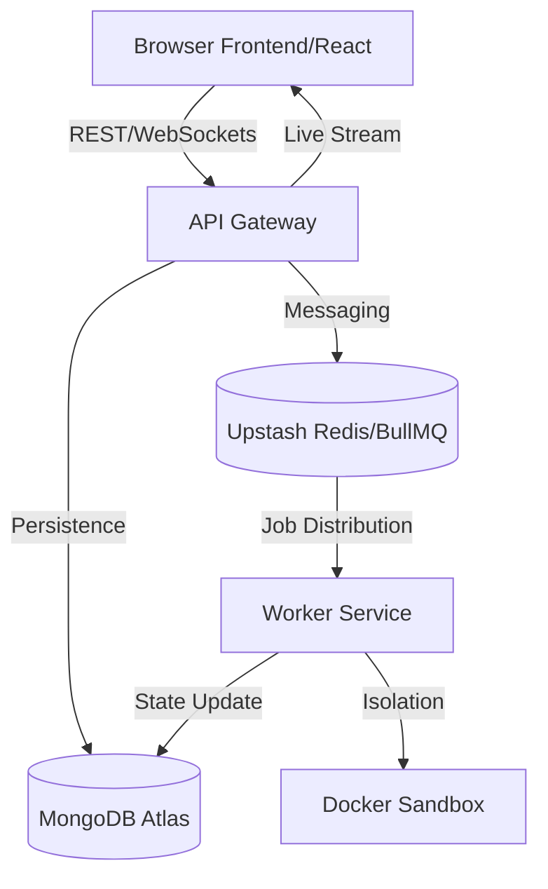

# 💧 LiquidIDE: The Enterprise-Grade Fluid Code Playground

LiquidIDE is a high-performance, **production-ready** browser-based IDE designed for safe, sandboxed code execution at scale. Built with the MERN stack, BullMQ, and Docker, it provides a seamless developer experience inspired by VS Code and Replit.

---

## ✨ Key Features

- **🚀 Real-time Execution**: Instant feedback on your code runs with low-latency streaming.
- **🛡️ Multi-Layer Sandboxing**: Isolation using Docker containers, PID limits, and CPU/Memory caps.
- **⚡ Reactive Architecture**: Distributed workers handle execution jobs, ensuring the API remains responsive.
- **🎨 Modern UI**: Vibrant, glassmorphism-inspired interface with Monaco Editor and Activity Bar.
- **📂 Integrated File System**: Manage complex projects with ease directly in your browser.

---

## 🏗️ Technical Architecture

LiquidIDE is built for stability and horizontal scalability.



### Stack & Components
- **Frontend**: React + Vite + Monaco Editor + Tailwind CSS + Socket.io Client.
- **Backend API**: Node.js + Express + Passport.js (Auth) + Socket.io.
- **Worker**: BullMQ + Docker Engine API + Node-Docker integration.
- **Infrastructure**: MongoDB (Persistence) + Redis (Queue/Cache).

---

## 🚀 Deployment

LiquidIDE is designed to run anywhere Docker is supported.

### Recommended Production Setup
- **API & Frontend**: Can be deployed to platforms like **Vercel** or **Render**. Ensure your MongoDB IP Whitelist allows requests from these services.
- **Worker**: Requires a persistent environment with Docker access (e.g., Render Web Service with a Docker runtime, or an AWS/GCP instance).

### 🛡️ Security Configuration
1. **Network Isolation**: Sandboxes are restricted from network access by default (`--network none`).
2. **Resource Quotas**: CPU usage is capped at 0.5 cores and memory at 256MB per run.
3. **Stateless Runs**: Every execution starts with a fresh container image.

---

## 🛠️ Local Installation

1. **Clone the Repository**:
   ```bash
   git clone https://github.com/syedmukheeth/Liquid-IDE.git
   cd Liquid-IDE
   ```

2. **Install Dependencies**:
   ```bash
   npm install
   ```

3. **Start Infrastructure**:
   ```bash
   docker compose up -d mongo redis
   ```

4. **Launch Development Environment**:
   ```bash
   npm run dev
   ```
   *The IDE will be accessible at `http://localhost:5173`.*

---

## ⚙️ Environment Variables
| Variable | Description | Default |
|----------|-------------|---------|
| `MONGO_URI` | MongoDB connection string | (Required) |
| `REDIS_URL` | Redis connection URL | (Required) |
| `WEB_ORIGIN` | Allowed CORS origin | `http://localhost:5173` |
| `JWT_SECRET` | Secret for token signing | (Required) |

---
*Built with ❤️ for developers who need a safe, fluid, and powerful playground.*
