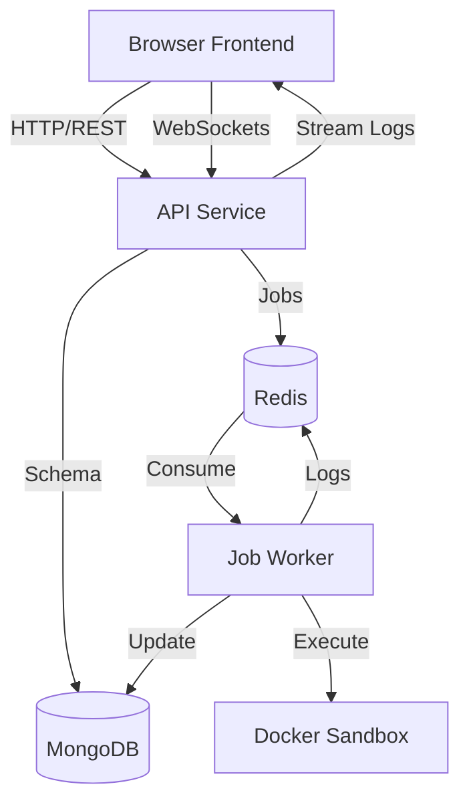

# LiquidIDE 🚀

LiquidIDE is a production-grade, scalable browser-based IDE (VS Code / Replit style) that allows users to write and execute code **safely** in sandboxed environments.

## 🏗️ Architecture

LiquidIDE uses a distributed architecture to ensure high availability, scalability, and security.



### Components
- **Frontend (`apps/web`)**: A high-performance React SPA with Monaco Editor.
- **API (`apps/api`)**: Node.js Express server handling project management, job queuing (BullMQ), and real-time log streaming using WebSockets.
- **Worker (`apps/worker`)**: Distributed workers that consume execution jobs and manage sandboxed Docker containers.
- **Shared (`packages/shared`)**: Shared types and constants across the monorepo.

## 🛡️ Security & Sandboxing
Code execution is isolated using a dual-layer strategy:
1. **Container Isolation**: Each run executes in a stateless, short-lived Docker container.
2. **Resource Limits**: Configurable memory (256MB), CPU (0.5), and PID limits prevent rogue processes from affecting the host.
3. **Network Isolation**: Sandbox containers are started with `--network none` to prevent data exfiltration.

## 🚀 Quick Start (Production-Like)

The entire stack is containerized for easy deployment and local development.

### Prerequisites
- Docker Desktop (Windows/Mac/Linux)
- Node.js 20+ (for local development)

### One-Command Setup
```bash
docker compose up --build -d
```
Access the application at [http://localhost](http://localhost).

## 🛠️ Local Development

1. **Install Dependencies**:
   ```bash
   npm install
   ```

2. **Setup Infrastructure**:
   ```bash
   docker compose up -d mongo redis
   ```

3. **Run Services**:
   ```bash
   # Run all in parallel
   npm run dev
   ```

## 📈 Monitoring & Logs
LiquidIDE uses structured logging via **Pino**. In development, logs are pretty-printed for readability. In production, logs are output in JSON format for easy ingestion by ELK, Splunk, or Datadog.

- **API Health**: `GET /health`
- **Worker Health**: `GET localhost:3001/health`

## ⚙️ Configuration
Environment variables can be tuned in `.env` files for each service:
- `MONGO_URI`: MongoDB connection string.
- `REDIS_URL`: Redis connection string.
- `RUN_TIMEOUT_MS`: Maximum execution time for a job.
- `SANDBOX_NODE_IMAGE`: The Docker image used for the sandbox.

---
*Built with ❤️ for developers who need a safe playground.*

