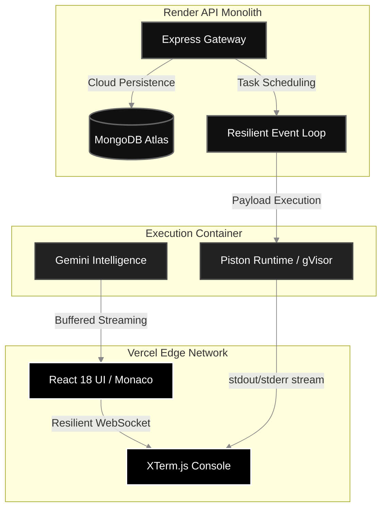

<div align="center">
  <br>
  <a href="https://sam-compiler-web.vercel.app/" target="_blank">
    
  </a>
  
  <h1><b>SAM Compiler</b></h1>
  
  <p><b><code>SYNTAX ANALYSIS MACHINE</code></b></p>

  <p>
    <i>"Elite Engineering. Zero Friction. Uncompromising Performance."</i>
  </p>

  <p align="center">
    
    
    
  </p>

  <br>

  <h3>
    <a href="https://sam-compiler-web.vercel.app/">► LAUNCH WORKSPACE</a>
  </h3>
  <br>
</div>

---

## ⚡ REIMAGINING THE CLOUD IDE

**SAM Compiler** is an elite, high-fidelity development environment engineered for speed, resilience, and intelligence. Unlike traditional web-based compilers, SAM utilizes a **Decoupled Architecture** that segregates the UI rendering layer from the code execution kernel, resulting in zero-latency 60FPS interaction and military-grade stability.

### 🏆 Why SAM is the Superior Standard

| Feature | The SAM Standard | Industry Average |
|---|---|---|
| **Intelligence** | **SAM AI Kernel**: Hardened Gemini 1.5 Flash with retry-resilience and fault-tolerant streaming. | Primitive GPT-3.5 wrappers with high failure rates. |
| **Stability** | **Resilient Topology**: Multi-layered WebSocket heartbeats with automatic polling fallbacks. | Single-channel sockets that drop sessions on network glitches. |
| **Security** | **Military-Grade Isolation**: Code executes inside locked-down `gVisor` containers. | Basic Docker containers without kernel-level sandboxing. |
| **Responsiveness** | **Adaptive Fluid System**: Spring-animated drawers and touch-optimized workspace for mobile excellence. | Basic media queries that break under IDE complexity. |
| **Logic** | **Mathematical CRDTs**: Powered by Yjs for seamless, conflict-free data synchronization. | Simple text-diffs prone to state corruption and data loss. |

---

## 🛠️ THE TECH STACK ARSENAL

<div align="center">
  <b>FRONTEND CORE</b><br>
  
  
  
  
  
  <br><br>
  
  <b>API & BACKEND RUNTIME</b><br>
  
  
  
  
  <br><br>
  
  <b>ARTIFICIAL INTELLIGENCE & INFRA</b><br>
  
  
</div>

---

## 🎨 THE "DIGITAL OBSIDIAN" DESIGN SYSTEM

SAM is built on the **Obsidian** design philosophy—a space-black, borderless UI that prioritizes visual clarity and cognitive focus. The latest update introduces a **Native-Grade Mobile Experience** featuring spring-animated drawers, touch-optimized hit targets, and a fluid tab-based navigation system.

<div align="center">
  <br>
  <a href="https://sam-compiler-web.vercel.app/"></a>
  <br><br><br>

  <table width="100%">
    <tr>
      <td width="50%" align="center"><b>Elite History Log</b></td>
      <td width="50%" align="center"><b>Resilient AI Panel</b></td>
    </tr>
    <tr>
      <td align="center"></td>
      <td align="center"></td>
    </tr>
  </table>
  <br><br>

  <h3>Adaptive Mobile Architecture</h3>
  <br>
  
  
  
  
</div>

---

## 🧠 THE SAM AI KERNEL

Our AI integration is not just a side panel; it's a deep-system integration powered by **Google Gemini 1.5 Flash**.

- **Hand-Tuned Prompting**: Proactively refactors code based on Principal Engineer standards.
- **Fail-Safe Streaming**: Buffered SSE parsing ensures you never see corrupted responses, even on unstable connections.
- **Intelligent Handshake**: Multi-attempt retries for transient Google AI service demands.

---

## 🏗️ ADVANCED TOPOLOGY

SAM handles massive concurrent payloads by utilizing an optimized MONO-distributed system.



---

## 🚀 BOOTUP PROTOCOLS

To initialize the SAM environment locally:

```bash
# 1. Clone the master repository
git clone https://github.com/syedmukheeth/SAM-Compiler.git

# 2. Boot the API Core Engine 
cd SAM-Compiler/apps/api 
npm install && npm start

# 3. Boot the Frontend Interface
cd ../web 
npm install && npm run dev
```

---

<div align="center">
  <br>
  <b>Designed & Engineered for Performance Excellence by</b>
  <br><br>
  <a href="https://linkedin.com/in/syedmukheeth">
    
  </a>
  <br><br>
  <sub>v3.6.0-ADAPTIVE | Obsidian Principal Edition</sub>
</div>
