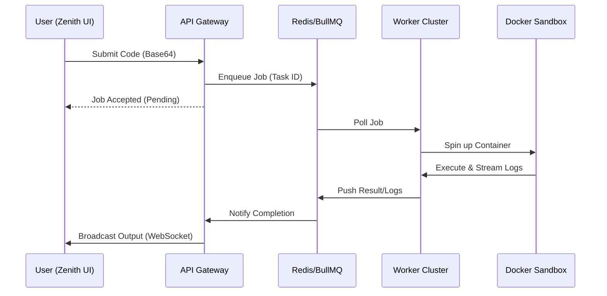

# SAM Compiler: System Design & Architecture

## 1. Executive Summary
SAM Compiler is a distributed, high-availability Code Execution Engine designed for the modern web. Unlike traditional monolithic compilers, SAM separates the **Control Plane** (API & Orchestration) from the **Data Plane** (Execution & Workers), ensuring maximum security, scalability, and resilience.

## 2. Core Architecture
The system follows a **Decoupled Asynchronous Architecture**.

### 2.1 The Control Plane (API Gateway)
- **Tech Stack**: Node.js, Express, Socket.io, BullMQ.
- **Responsibilities**: 
  - Authenticating users via JWT.
  - Managing real-time editor state using **Yjs (CRDT)**.
  - Offloading code execution tasks to the Redis-backed queue.
  - Orchestrating AI interactions with Google Gemini.

### 2.2 The Data Plane (The Foundry)
- **Tech Stack**: Node.js, Docker, gVisor (optional).
- **Responsibilities**:
  - Polling the BullMQ queue for new execution jobs.
  - Provisioning ephemeral Docker containers for specific runtimes (Node, Python, C++, etc.).
  - Monitoring resource usage (CPU/Memory) and enforcing strict timeouts.
  - Streaming output logs back to the Control Plane via Redis.

## 3. Data Flow & Execution Pipeline

## 4. Security & Isolation Matrix
Security is not an afterthought in SAM; it is built into the kernel.

| Feature | Implementation | Purpose |
|---|---|---|
| **Hardened Sandboxing** | Ephemeral Docker Containers | Prevents file system access and persistent exploits. |
| **Network Isolation** | Internal Bridge (No Internet) | Prevents data exfiltration and SSRF attacks. |
| **Resource Limits** | Docker Cgroups | Prevents Fork Bombs and Memory Exhaustion. |
| **Payload Security** | Base64 Encoding | Ensures 100% diagnostic accuracy for malformed code. |
| **JWT Guard** | RSA256 Auth | Ensures only authorized users can trigger expensive compute jobs. |

## 5. Intelligent Diagnostics (SAM AI)
SAM integrates **Gemini 1.5 Flash** to provide principal-grade code analysis.
- **Context Awareness**: The AI receives not just the code, but also current execution metrics (latency, error logs).
- **Fallback Resilience**: Multi-model fallback logic ensures the AI remains available even during high demand.
- **Streaming UI**: Responses are streamed in real-time to provide a smooth, interactive experience.

## 6. Monorepo Organization
The project uses a monorepo structure to share code and types across components.

- `apps/api`: The brain. Handles business logic and orchestration.
- `apps/web`: The face. A high-performance React application.
- `apps/worker`: The muscle. Manages the heavy lifting of code execution.
- `packages/shared`: The backbone. Contains constants, utility functions, and shared TypeScript types.

## 7. Scaling Strategy
- **Vertical Scaling**: Increase `WORKER_CONCURRENCY` in `.env` to handle more parallel jobs per node.
- **Horizontal Scaling**: Deploy multiple `worker` instances connected to the same Redis cluster to increase total throughput.
- **Edge Delivery**: The frontend is optimized for deployment on Vercel Edge for global low-latency access.

---

*This document is part of the SAM Compiler Technical Documentation suite. Version 6.0 - Zenith.*
